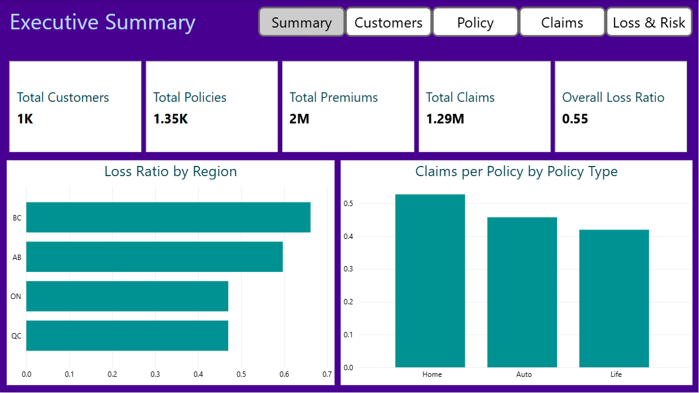
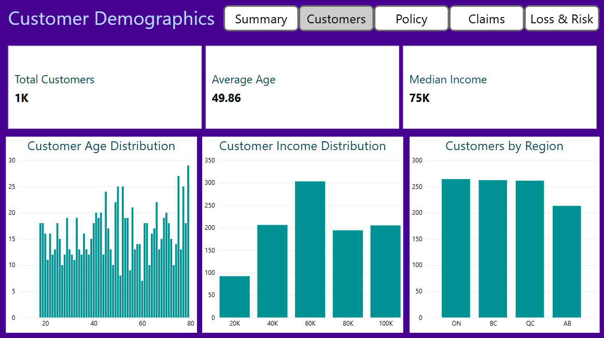
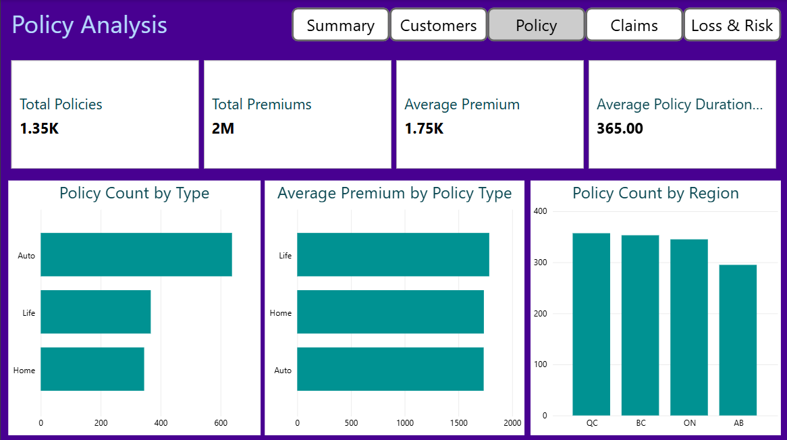
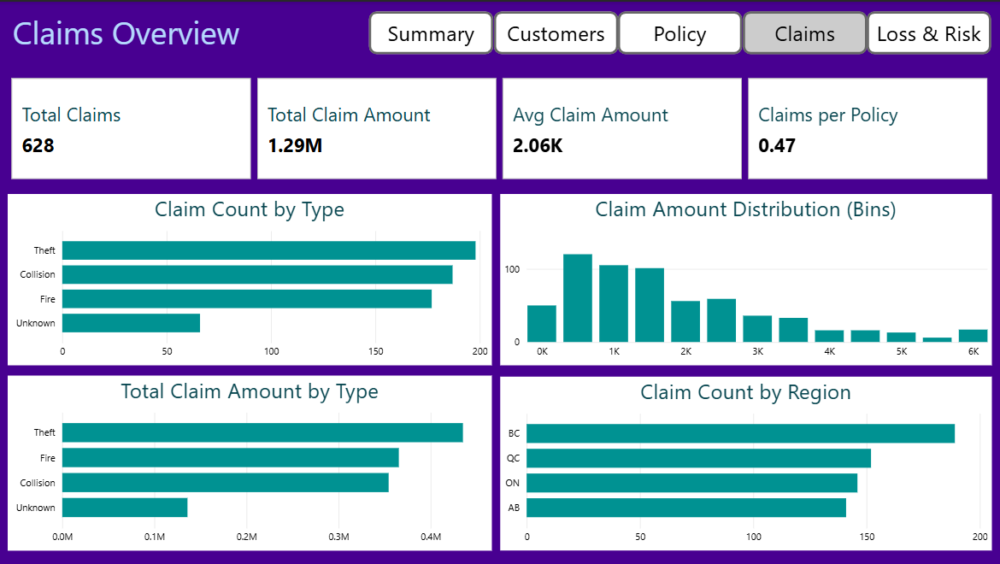
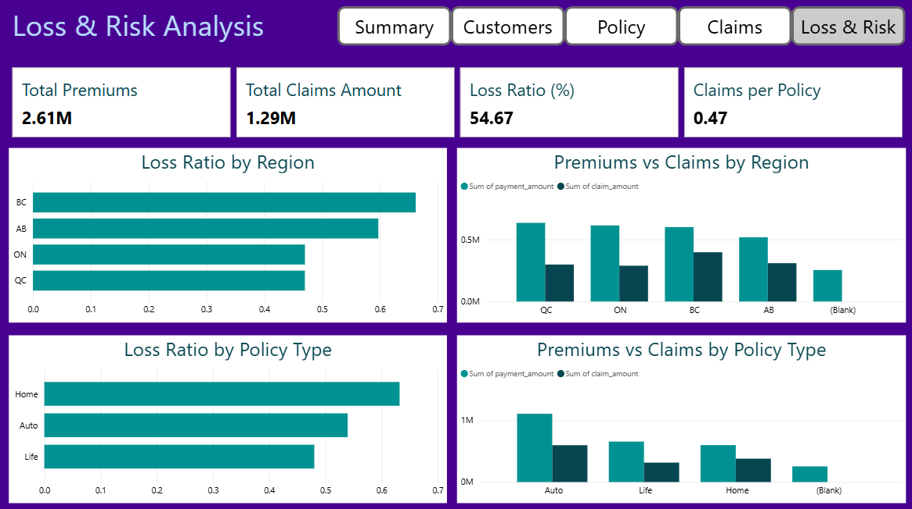

# Insurance Portfolio Analysis Project

## 📊 Overview

This project analyzes customer, policy, claim, and payment data for a simulated insurance portfolio.  
It demonstrates an end-to-end workflow using **SQL, Python, and Power BI**, from data generation and cleaning to analysis and dashboarding.

The goal is to identify **risk patterns, loss ratios, claim frequencies, and customer demographics** to support business decision-making.

---

## 🔍 Key Findings

- Loss ratios vary across regions, with **BC and AB** showing higher loss ratios than ON and QC.  
- Claims are fairly evenly distributed across **Collision, Theft, and Fire**, with a smaller group of claims labeled as Unknown.  
- Customer demographics show **clusters by age and income**, but no single age group dominates.  
- Policy distribution is balanced among **Auto, Home, and Life**, with similar average premiums across types.  
- Some high-value claims and customers represent **concentrated risk**, highlighting areas for monitoring.

---

## 🧰 Tools Used

- **SQL (SQLite)** – querying and aggregating synthetic datasets  
- **Python (pandas, numpy, matplotlib, seaborn)** – data generation, data cleaning, exploratory analysis, and visualizations  
- **Power BI** – interactive dashboard visualizations (screenshots included)  

---

## 📁 Project Contents

All project files are located in this folder:

- **Jupyter notebooks (`.ipynb`)** – data generation, cleaning, analysis, and SQL queries  
- **PDF notebooks (`.pdf`)** – for users without Python  
- **Data folder (`data/`)** – raw, clean, and reference datasets  
- **Power BI file (`.pbix`)** – interactive dashboard  
- **Screenshots (`screenshots/`)** – static images of dashboard pages  

---

## ▶️ How to View This Project

1. **Start with the PDF notebooks**  
   → Read through the analysis and insights without requiring Python  

2. **Review the dashboard screenshots**  
   → Visual representations of key metrics and business insights  

3. *(Optional)* Open the Jupyter notebooks (`.ipynb`)  
   → Explore full code, SQL queries, and step-by-step analysis  

4. *(Optional)* Open the Power BI dashboard (`.pbix`)  
   → Interact with slicers and filters to explore the portfolio  

---

## 📊 Dashboard Page Descriptions

### 1. Executive Summary

  

*High-level view of portfolio performance*  
**Key Insights:**  
- Total policies, total premiums, and total claims shown via cards  
- Loss ratio by region provides immediate risk overview  

---

### 2. Customer Demographics

  

*Visual breakdown of customer age, income, and region*  
**Key Insights:**  
- Histograms show age and income distributions  
- Region and gender distributions highlight major customer segments  

---

### 3. Policy Analysis

  

*Analysis of policies in the portfolio*  
**Key Insights:**  
- Count of policies by type (Auto, Home, Life)  
- Average premium by policy type  
- Policies by region column chart  

---

### 4. Claims Overview

  

*Analysis of claims by type, amount, and region*  
**Key Insights:**  
- Count of claims by type and region  
- Total claim amounts by type  
- Distribution of claim amounts across binned ranges  

---

### 5. Loss & Risk Analysis

  

*Assessment of portfolio risk*  
**Key Insights:**  
- Loss ratio by region and policy type  
- Total premiums and total claims compared across regions and policy types  
- Identifies high-risk areas for monitoring  

---

## 💡 Key Metrics Analyzed

- Number of policies per type and region  
- Average premium amounts  
- Number of claims per type and region  
- Total claim amounts  
- Loss ratios by region and policy type  

---

## ⚠️ Notes

- All data is **synthetic** and generated for demonstration purposes  
- Some patterns reflect the **data generation process**, not real-world insurance portfolios  
- Dashboard colors are **colorblind-friendly** for accessibility  

---

## 📬 Contact

stacey.mike@gmail.com  

Feel free to reach out with feedback or portfolio inquiries!